# Cross-Asset Allocation Lens

## Final report — Project B

### Executive summary

Cross-Asset Allocation Lens is an educational prototype for comparing systematic Equity, Crypto, and Combined funds, examining a coverage-aware news-sentiment signal, and testing user-specified allocations over a common out-of-sample (OOS) period. The project produces 13 funds: Equal Weight, Minimum Variance, Risk Parity, and Maximum Sharpe in each of the three universes, plus a fixed sentiment-augmented Equity Risk Parity fund.

The main result is not a single “best fund.” The 2021–2023 OOS evidence shows a clear return–risk trade-off across universes and methods. Crypto funds delivered the highest sample returns but also annualised volatility of 72.5%–81.9% and maximum drawdowns of 72.7%–81.6%. Within Equity and Combined, Minimum Variance delivered the lowest volatility and shallowest drawdown, while Equal Weight or Risk Parity delivered stronger sample Sharpe ratios. Maximum Sharpe did not dominate: it had the highest turnover in both Equity and Combined and weaker net performance than their Equal Weight and Risk Parity counterparts.

The predeclared sentiment extension also produced a useful negative result. Relative to base Equity Risk Parity over the identical 753-date OOS period, the fixed coverage-aware overlay reduced net cumulative return by 1.19 percentage points, reduced net Sharpe from 0.713 to 0.694, slightly deepened maximum drawdown, and increased turnover by 0.522. The rule was not retuned after observing that outcome. This is descriptive OOS evidence for this dataset and specification, not a test of statistical significance and not proof that sentiment is generally useless.

The application turns the committed outputs into a five-stage investor journey: orientation, fund comparison, fact sheets, allocation simulation, and sentiment/fusion evidence. It performs no backtest, optimisation, sentiment scoring, fusion, or network access at runtime. It is not personalised financial advice, does not recommend an allocation, and excludes management fees, taxes, and additional cross-fund transaction costs.

## 1. Product question and fund menu

The product question is: **how can a self-directed investor or junior portfolio analyst compare transparent systematic funds across distinct asset universes without hiding timing, missing-data, cost, or model-risk limitations?** The design separates the analytical engine from the investor interface. The analytical engine creates audited, precomputed OOS artifacts. The application reads only those committed artifacts and provides explanation and controlled simulation.

The fund menu contains three universes:

- **Equity:** 50 cleaned equity tickers on observed equity dates.
- **Crypto:** 10 cleaned crypto tickers on their native seven-day calendar.
- **Combined:** the 50 equities plus crypto returns selected from the already-calculated native crypto return series onto observed equity dates.

Each universe has Equal Weight, Minimum Variance, Risk Parity, and Maximum Sharpe funds. The thirteenth fund applies a fixed finance-sentiment overlay to Equity Risk Parity. All funds are long-only, fully invested prototypes with the same dynamic per-asset cap within each eligible universe. “Current holdings” in the application means the latest target weights from the most recent historical rebalance, not live holdings.

## 2. Data foundation and information boundaries

The official data contain adjusted-close prices for 50 equities and 10 crypto assets and supplied news headlines for the equity tickers. The common analytical sample is capped at 2023-12-31. After deterministic cleaning, the portfolio audit records 50,300 equity-price rows, 14,610 crypto-price rows, and 146,836 news rows. Missing returns are retained rather than filled. Exact news duplicates on ticker, normalised date, and title are removed, while the original headline text and timestamp are preserved for sentiment and audit.

Simple adjusted-close returns are calculated within ticker without forward filling. Crypto returns are first calculated on the native seven-day calendar. The Combined universe then selects those already-computed returns on equity dates; it does not merge weekend price levels onto an equity calendar before differencing. This prevents a multi-day weekend move from being mislabelled as a one-day equity-calendar return. Equity and Combined use 252-period annualisation; Crypto uses 365.

News uses **Rule A — Conservative Calendar-Date Mapping**. A headline on an observed equity calendar date maps to that date; otherwise it maps to the next observed equity date. The supplied clock time is not treated as verified publication time. The mapped daily signal is then lagged by one additional observed equity day before it may affect a portfolio. Six final-boundary rows remain in the audit but cannot be mapped to a later observed equity date and are excluded from calculations requiring a valid mapped date.

These boundaries matter economically. The dataset does not justify intraday or after-close claims, the observed dates are not a complete exchange calendar, and no supplied headline does not prove that no news existed. It means missing coverage in the supplied data.

## 3. Walk-forward portfolio construction

### 3.1 OOS schedule

Every base fund uses an expanding walk-forward process. Equity and Combined require an initial 252 observations; Crypto requires 365. A decision is made on the last observed panel date of each calendar month, using information through that date only. Its target first becomes effective on the next observed date in the following calendar month. Therefore, no holding-period return can influence the weights applied to itself.

At each decision, an asset must have a valid return on the decision date and enough valid historical observations. Estimation uses complete historical rows across the then-eligible assets. Missing returns are never imputed. The portfolio is fully invested and long-only, with maximum weight

`min(35%, 5 / eligible asset count)`.

The covariance matrix is the sample covariance with fixed 10% diagonal shrinkage. Maximum Sharpe uses expanding arithmetic means shrunk 50% toward their cross-sectional mean. The risk-free rate is zero. Minimum Variance, Risk Parity, and Maximum Sharpe use SciPy SLSQP with fixed solver tolerances. A solver failure is never silently ignored: the engine reuses the previous feasible target if it remains feasible, otherwise it applies capped Equal Weight, and logs the event. Five fallback events occurred in Crypto Risk Parity; all other reported base funds record zero fallbacks.

### 3.2 Trading costs and performance measures

The initial investment has turnover 1.0. Subsequent one-way turnover is half the sum of absolute changes between a new target and the pre-trade drifted portfolio across the union of old and new assets. Trading cost equals 0.001 times turnover, or 10 basis points one way. On effective rebalance dates, net return is `(1 - cost) × (1 + gross return) - 1`; otherwise net return equals gross return.

The report emphasises net results. Annualised return is the arithmetic daily mean times 252 or 365, annualised volatility is sample standard deviation times the square root of that factor, and Sharpe is annualised excess return divided by annualised volatility. Growth of $1 and drawdown use compounded simple returns. These conventions make the calculations reproducible, but annualised arithmetic return should not be read as a guaranteed compound rate.

Figure 1 shows how the 13 funds compare. Two panels use different axes so labels remain legible; values should therefore be compared from the printed scales rather than the visual distance between panels.

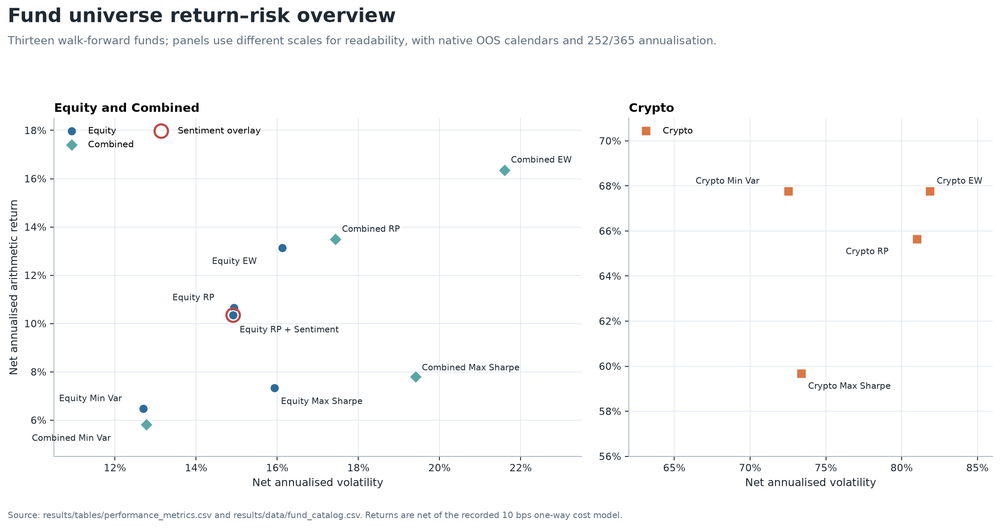

The complete machine-readable table is [`report_fund_summary.csv`](../results/tables/report_fund_summary.csv). Table 1 presents its main net metrics.

### Table 1. Net OOS performance by fund

| Universe | Method | Cumulative return | Ann. return | Ann. volatility | Sharpe | Max drawdown | Total turnover |
|---|---|---:|---:|---:|---:|---:|---:|
| Equity | Equal Weight | 42.44% | 13.14% | 16.12% | 0.815 | -20.26% | 1.953 |
| Equity | Minimum Variance | 18.45% | 6.47% | 12.70% | 0.510 | -17.23% | 1.991 |
| Equity | Risk Parity | 32.97% | 10.65% | 14.93% | 0.713 | -19.40% | 1.902 |
| Equity | Maximum Sharpe | 19.87% | 7.34% | 15.93% | 0.461 | -25.23% | 4.359 |
| Crypto | Equal Weight | 176.52% | 67.77% | 81.89% | 0.828 | -81.59% | 3.082 |
| Crypto | Minimum Variance | 244.06% | 67.76% | 72.53% | 0.934 | -72.73% | 3.242 |
| Crypto | Risk Parity | 164.88% | 65.64% | 81.01% | 0.810 | -81.55% | 3.331 |
| Crypto | Maximum Sharpe | 165.27% | 59.67% | 73.40% | 0.813 | -79.63% | 2.807 |
| Combined | Equal Weight | 52.01% | 16.36% | 21.60% | 0.757 | -27.90% | 2.350 |
| Combined | Minimum Variance | 16.11% | 5.81% | 12.77% | 0.455 | -17.11% | 1.995 |
| Combined | Risk Parity | 42.98% | 13.49% | 17.44% | 0.774 | -22.39% | 2.133 |
| Combined | Maximum Sharpe | 19.32% | 7.79% | 19.41% | 0.402 | -29.67% | 4.582 |
| Equity | Risk Parity + Sentiment | 31.78% | 10.35% | 14.91% | 0.694 | -19.63% | 2.424 |

*Source: committed `performance_metrics.csv` and `fund_catalog.csv`. Equity and Combined cover 2021-01-04 to 2023-12-29 (753 observations); Crypto covers 2021-01-01 to 2023-12-31 (1,095 observations). Returns are net of the recorded trading-cost model.*

## 4. OOS fund evidence

The Equity results illustrate that an optimiser label is not a performance guarantee. Equal Weight achieved the highest Equity net Sharpe (0.815) and cumulative return (42.44%). Minimum Variance achieved its stated risk objective: the lowest Equity volatility (12.70%) and shallowest maximum drawdown (-17.23%), but with a lower annualised return. Risk Parity occupied a middle position. Maximum Sharpe had the highest Equity turnover (4.359) and a lower realised net Sharpe (0.461) than the other three Equity funds. Expected-return estimates are noisy, so an ex-ante maximum-Sharpe objective need not deliver the highest realised OOS Sharpe.

The Combined results follow a similar pattern. Risk Parity produced the highest Combined net Sharpe (0.774), narrowly above Equal Weight (0.757). Minimum Variance again delivered the lowest volatility and shallowest drawdown, while Maximum Sharpe produced the highest turnover and deepest Combined drawdown. Adding crypto to the universe did not create a uniformly superior outcome: risk was lower than in Crypto-only funds but higher than in comparable Equity funds for Equal Weight and Risk Parity.

Crypto outcomes require the strongest caution. Minimum Variance had the highest sample Sharpe (0.934) and cumulative return (244.06%), yet still experienced a -72.73% maximum drawdown. The other Crypto funds drew down about 80%. High sample return therefore came with loss paths that many investors could not tolerate. The three-year window is also too short to establish a stable long-run crypto risk premium.

To make path dependence visible without choosing a different method for each universe, Figures 2 and 3 hold Risk Parity constant across Equity, Crypto, and Combined and show the sentiment overlay separately.

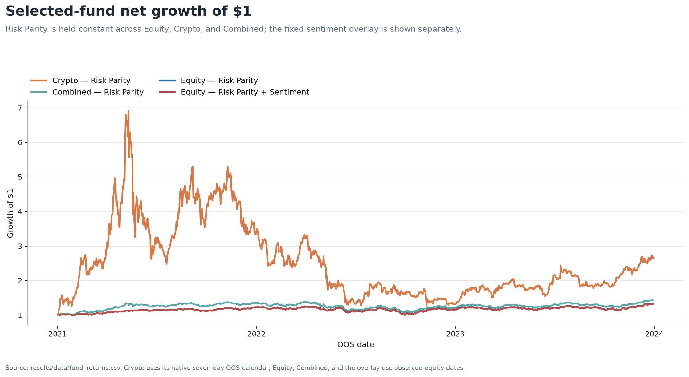

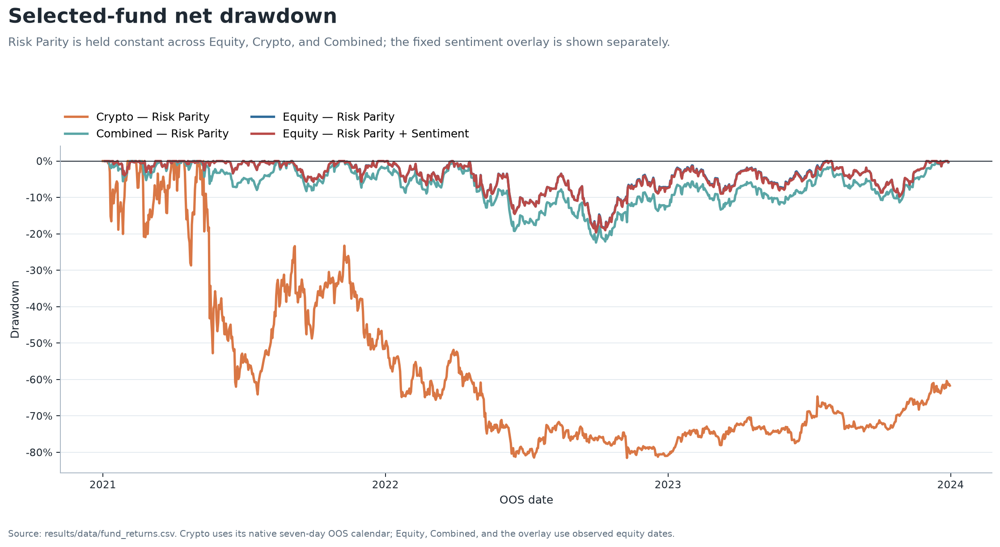

Figure 2 shows that the Crypto path peaked early and then gave back a large portion of its gain. Figure 3 makes the corresponding drawdown persistence explicit. By contrast, Equity and Combined Risk Parity stayed within much narrower drawdown ranges. Terminal return alone would conceal this difference.

Figure 4 shows monthly Equity target histories for the five highest average-weight stocks within each method. Equal Weight lines coincide because all 50 assets receive the same capped benchmark weight. Minimum Variance and Maximum Sharpe frequently meet the 10% cap implied by `5 / 50`, while Risk Parity distributes its displayed top weights more evenly. Only five stocks are shown in each panel for legibility; the omitted holdings remain in the fully invested funds.

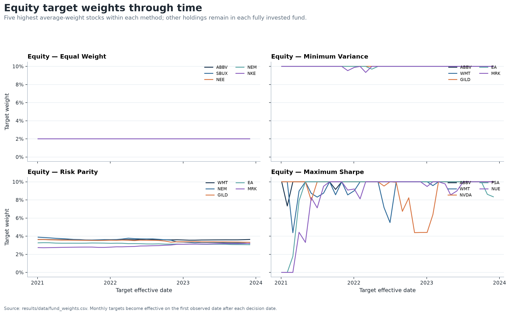

The figure supports a method interpretation, not a stock recommendation. It also shows why turnover belongs beside returns: concentrated or unstable targets can generate additional implementation cost even when constraints are satisfied.

## 5. Coverage-aware sector sentiment

The baseline model is plain VADER. The main model is an isolated finance-extended VADER using a frozen 29-term approved lexicon. Headline text is scored unchanged so punctuation, negation, contrast, and boosters remain available. The finance extension changed the compound score of 3,860 of 105,330 distinct titles (3.66%) and changed the positive/neutral/negative classification of 1,199 titles at the ±0.05 threshold. These are sensitivity results, not accuracy results: there is no labelled outcome validation showing that a changed score is a better score.

Aggregation preserves coverage. Headline scores are averaged to ticker-day, then observed eligible ticker-days are equal-weighted to sector-day. A ticker-day with no supplied headline is missing. A sector-day with no observed ticker sentiment is also missing. Coverage is the share of eligible sector tickers that have at least one supplied mapped headline.

Materials is used as the report example because its gaps make the missingness policy visible. Across 1,006 observed equity dates, 939 Materials sector index values are observed and 67 are missing; mean eligible-ticker coverage is 53.1%. Figure 5 leaves genuine no-news sector dates as line gaps rather than inserting a neutral score of 50.

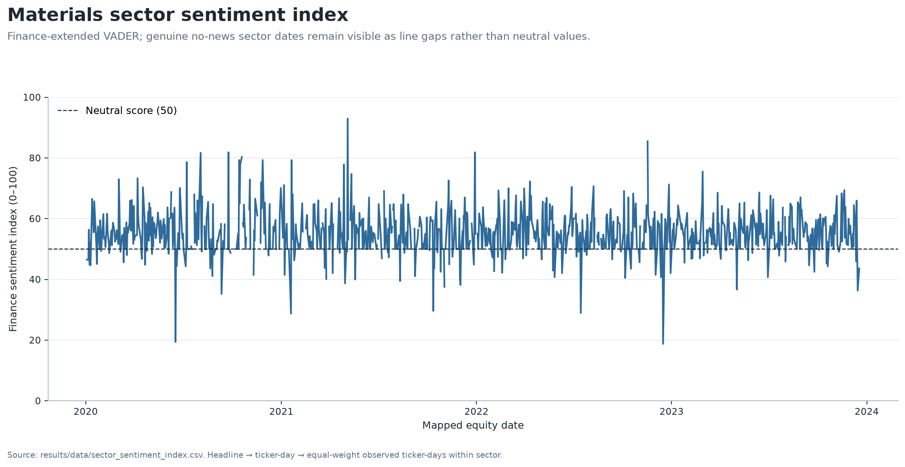

Figure 6 separates description from a tradable signal. For each sector and model, a causal expanding z-score uses information through the source date, requires at least 252 available historical sector observations, and uses sample standard deviation. That completed signal is shifted by exactly one observed equity day. If later sector observations are wholly missing, the last signal may carry for ages 1–5 while effective coverage decays as `source coverage × (6 - age) / 6`; at age 6 it expires. Materials has 724 non-missing tradable observations, including 36 carried observations. Full-sample descriptive z-scores never enter this signal.

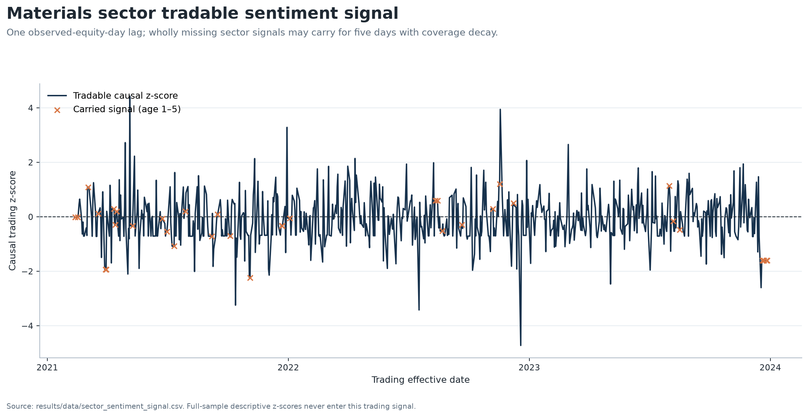

Figure 7 shows why the coverage field cannot be omitted. Coverage is often below 100% and changes materially through time. A similar index level supported by one observed ticker and by an entire sector should not receive the same confidence in a portfolio rule.

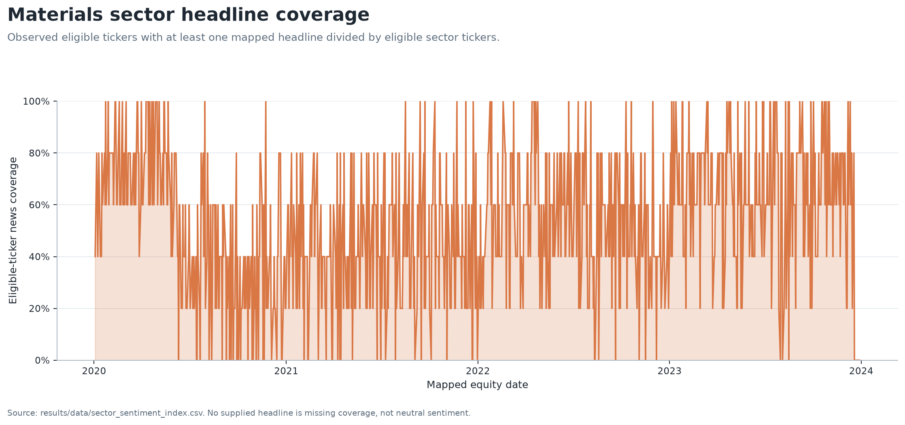

## 6. Fixed sentiment fusion experiment

The primary fusion experiment augments Equity Risk Parity with the finance-VADER sector signal only. At each base decision date, the overlay uses the signal whose effective date matches the portfolio target effective date. It clips the causal lagged z-score to [-2, 2] and applies the predeclared multiplier

`clip(1 + 0.10 × effective coverage × clipped z-score, 0.80, 1.20)`.

A missing signal receives multiplier 1.0. Stock weights are multiplied by their sector multiplier, renormalised, and projected back to the same capped simplex. The augmented fund has its own drifted holdings, turnover, cost, and realised return calculation. It is not a relabelled copy of the base fund. The fixed `lambda = 0.10`, z-score clip, multiplier bounds, lag, and carry were not tuned on realised fusion performance.

### Table 2. Base versus fixed augmented Equity Risk Parity

| Net OOS metric | Base | Augmented | Augmented minus base |
|---|---:|---:|---:|
| Cumulative return | 32.97% | 31.78% | -1.19 pp |
| Annualised return | 10.65% | 10.35% | -0.30 pp |
| Annualised volatility | 14.93% | 14.91% | -0.02 pp |
| Sharpe | 0.713 | 0.694 | -0.019 |
| Maximum drawdown | -19.40% | -19.63% | -0.23 pp |
| Total turnover | 1.902 | 2.424 | +0.522 |
| Total trading cost | 0.190% | 0.242% | +0.052 pp |

*Source: [`fusion_comparison.csv`](../results/tables/fusion_comparison.csv), common OOS period 2021-01-04 to 2023-12-29, 753 observations. “pp” denotes percentage points.*

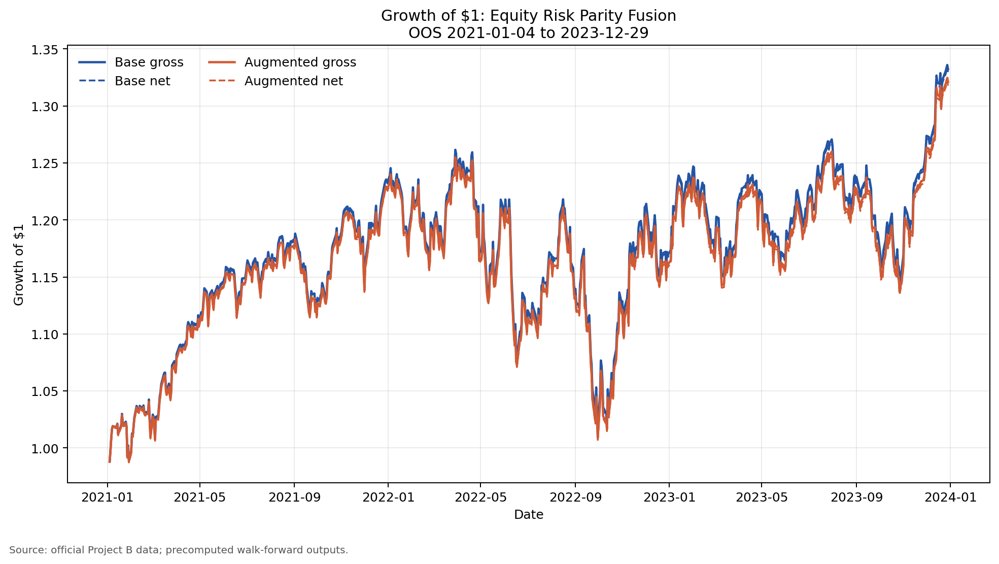

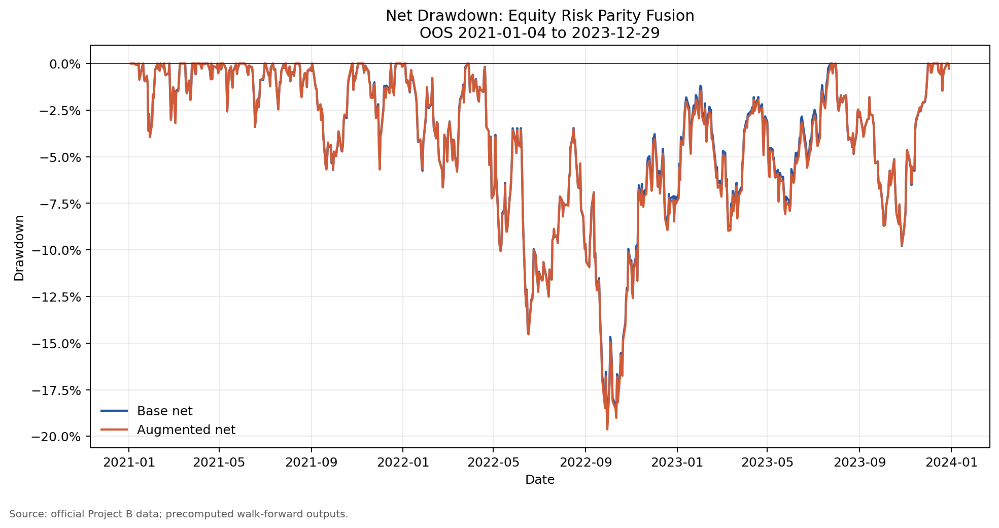

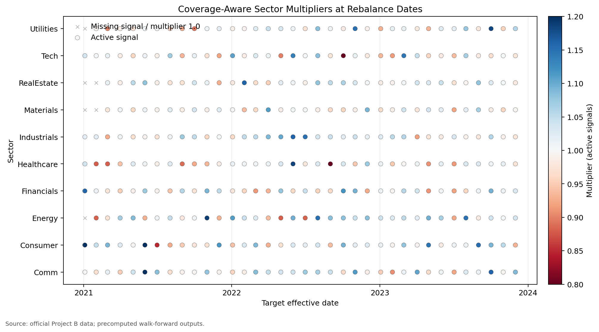

The augmented and base return series are highly similar: their correlation is 0.9998 and tracking error is 0.00288. Nevertheless, the small active deviations were not free. The augmented fund had lower terminal wealth, slightly worse drawdown, and higher turnover and trading cost. Figure 11 shows that the latest target changes are modest stock-level reallocations rather than a new portfolio regime.

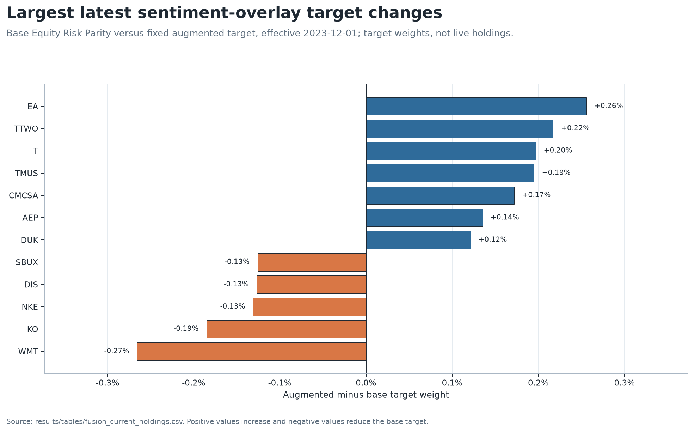

The correct conclusion is narrow: **this predeclared overlay did not add net value in this OOS sample**. Retuning `lambda` after seeing the result would convert a clean negative test into data mining. A later study can compare alternative specifications only with a separately defined training/validation protocol and untouched holdout data.

## 7. Investor application and illustrative allocation

The Streamlit application is a presentation layer over committed outputs. Its five tabs are:

1. **Start Here** — product scope, decision boundaries, and investor disclosures.
2. **Compare Funds** — all 13 funds, net metrics, and return–risk comparison.
3. **Fund Fact Sheets** — one fact sheet per fund with methodology, OOS dates, performance, growth, drawdown, turnover, and latest target weights.
4. **Allocation Lab** — two to six selected funds, non-negative weights summing to 100%, and either Buy & Hold or Monthly Reset over the exact common OOS date intersection.
5. **Sentiment & Fusion** — missingness-aware sector evidence and the unrevised negative fusion result.

Buy & Hold compounds independent initial fund sleeves and permits their weights to drift. Monthly Reset resets sleeves to the selected allocation on the first common-period date in each calendar month. Neither mode optimises or recommends the weights.

Figure 12 is a report-only illustration using 25% each in Equity Risk Parity, Crypto Risk Parity, Combined Risk Parity, and Equity Risk Parity + Sentiment, held Buy & Hold. The common period is 2021-01-04 to 2023-12-29 with 753 observations and no non-finite exclusions. The simulation produced a 33.13% cumulative return, 14.94% annualised return, 32.59% annualised volatility, 0.458 Sharpe, and -50.59% maximum drawdown.

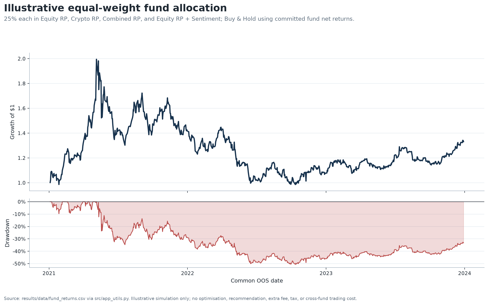

This allocation is deliberately simple and method-controlled; it is not selected because it maximises a reported metric. Its deep drawdown demonstrates that combining funds does not eliminate exposure to the Crypto sleeve. The underlying fund returns already include their recorded fund-level trading costs. The simulation applies no extra management fee, tax, slippage, or cross-fund transaction cost, so it should not be read as an implementable investor net return. Exact illustrative inputs and outputs are in [`report_allocation_example_weights.csv`](../results/tables/report_allocation_example_weights.csv) and [`report_allocation_example_metrics.csv`](../results/tables/report_allocation_example_metrics.csv).

## 8. Limitations and responsible interpretation

The evidence is reproducible within the project, but the economic conclusions remain limited:

- The OOS period is only 2021–2023 and contains a particular equity, crypto, inflation, and rate environment. It does not establish performance in other regimes.
- The study reports realised OOS paths but no confidence intervals, bootstrap uncertainty, or formal statistical significance. Small metric differences may be noise.
- Crypto and Equity use different native calendars and annualisation factors. Combined deliberately excludes weekend-only crypto observations, so direct comparisons require care.
- The 10-basis-point one-way cost is a fixed model. It does not capture spread variation, market impact, borrow, capacity, exchange fees, custody, management fees, taxes, or investor-level allocation costs.
- Maximum Sharpe depends on expanding historical mean returns, which are unstable. The fixed shrinkage reduces but does not remove estimation error.
- Headline sentiment excludes article bodies and uses supplied timestamps that are not verified publication times. Rule A and the extra trading lag are conservative controls, not proof of tradability.
- News coverage is incomplete and uneven. Missing supplied news is missing coverage, not neutral sentiment and not proof of no economically relevant news.
- The finance lexicon changes scores but has no separately labelled validation of semantic or predictive accuracy.
- The application uses historical, precomputed target weights and returns. It provides no live data, execution, suitability assessment, or personalised advice.

## 9. Recommendations for the next empirical cycle

### Recommendation 1 — protect a new holdout before testing alternatives

Pre-register any alternative fusion rule, parameter grid, and success metric using a development/validation period, then evaluate once on an untouched post-2023 holdout. Report uncertainty around the performance difference, not only point estimates. This is the minimum evidence needed before making a sentiment-predictability claim.

### Recommendation 2 — test implementation sensitivity before investor use

Recalculate fund and allocation outcomes across plausible spreads, fees, slippage, taxes, and capacity assumptions. Because Maximum Sharpe and the fixed overlay produced higher turnover in this sample, cost sensitivity could materially change their ranking. A production decision should also include liquidity and exchange/custody constraints.

### Recommendation 3 — strengthen timing and monitoring controls

Use verified publication timestamps and an authoritative exchange calendar before considering a live signal. Add automated checks for stale/missing data, coverage shifts, solver fallbacks, target concentration, realised tracking error, and model drift. A live process should stop or revert to a documented neutral/base state when these controls fail.

## 10. Reproducibility and artifact guide

The complete analytical pipeline is run with:

```text
python scripts/run_part_b.py
```

Report-only presentation artifacts are rebuilt from committed analytical outputs with:

```text
python scripts/build_report_artifacts.py
```

The second command does not load raw data, optimise portfolios, score headlines, or rerun fusion. It formats the complete 13-fund summary, creates figures from committed tables and app data, and calculates the clearly labelled illustrative allocation through the same allocation utility used by the application.

Key evidence files are:

- [`performance_metrics.csv`](../results/tables/performance_metrics.csv) — canonical 13-fund metrics.
- [`fund_returns.csv`](../results/data/fund_returns.csv) and [`fund_weights.csv`](../results/data/fund_weights.csv) — precomputed fund paths and targets.
- [`sentiment_data_audit.csv`](../results/tables/sentiment_data_audit.csv) and [`sentiment_model_comparison.csv`](../results/tables/sentiment_model_comparison.csv) — mapping, missingness, and model-sensitivity evidence.
- [`fusion_comparison.csv`](../results/tables/fusion_comparison.csv) — base/augmented comparison on identical dates.
- [`report_exhibit_catalog.csv`](../results/tables/report_exhibit_catalog.csv) — source and supported-claim mapping for every report figure.
- [`run_manifest.csv`](../results/tables/run_manifest.csv) — source checksum, environment, methodology constants, and canonical output hashes.

All reported results are historical OOS evidence from the supplied dataset. They are not current, causal, or an investment recommendation.
